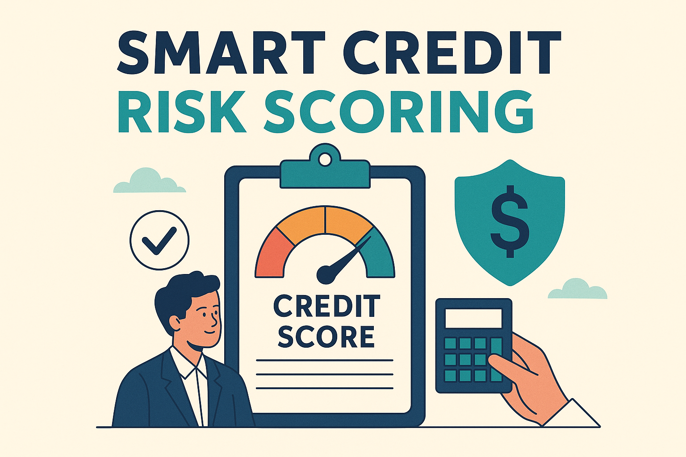
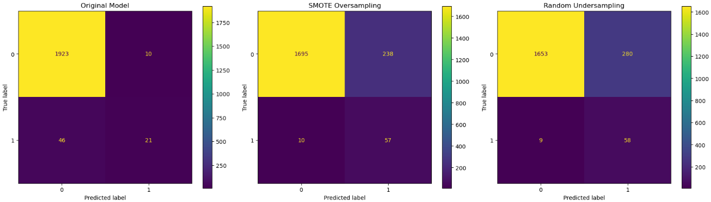
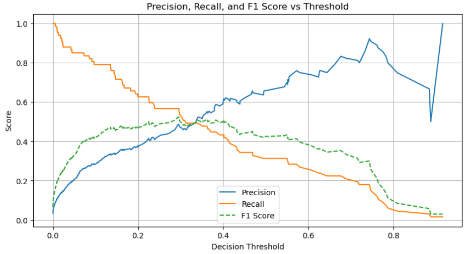

# Smart Credit Risk Scoring Project with Machine Learning to Predict Defaults and Empower Ethical Lending

## Overview

This project addresses a pressing challenge faced by a digital micro-lender in Kenya: **rising loan defaults** that threaten its **cash flow, profitability, and investor confidence**. The existing credit scoring system is manual and based on basic heuristics such as age, job type, and loan limits. This reactive approach lacks the precision and adaptability required to accurately identify potential defaulters early on.

Using **machine learning**, we developed a predictive model to assess the likelihood of a customer defaulting on their next month’s credit payment. This solution aims to enable **smarter, data-driven, and ethical lending decisions** while supporting **financial inclusion** and minimizing institutional risk.

---

## Business and Data Understanding

### Business Problem
A digital micro-lender in Kenya is experiencing rising loan default rates, threatening its cash flow, profitability, and investor confidence. The micro-lender current credit scoring system is manual and based on basic rules—such as age, job type, and credit limits, lacking the precision to identify potential defaulters early. Without a predictive, data-driven system that leverages behavioral, transactional, and historical repayment data, the lender remains reactive, increasing risk exposure and reducing efficiency in customer targeting. We are tasked to build a machine learning model to accurately predict if a client will default on their next month's credit payment to help the lender make smarter, fairer, and more sustainable lending decisions—supporting financial inclusion while minimizing risk.

### Stakeholders
Our primary stakeholders include:
- **Risk Managers** and **Credit Officers** who want a more accurate credit scoring tool.
- **Executives** and **Investors** seeking to minimize financial risk and boost profitability.
- **Product and Innovation Teams** aiming to integrate predictive analytics into digital loan platforms.

### Dataset Overview
The primary dataset used for this project is a single CSV file titled Default_Fin.csv, which contains anonymized borrowers information and loan-level features necessary for building a credit risk scoring model.

#### Dataset Source:
Default_Fin.csv [View the dataset on Kaggle](https://www.kaggle.com/datasets/kmldas/loan-default-prediction?resource=download)

The dataset simulates typical customer records for a credit service and contains:
- **Demographic information** (e.g., Age, Employment)
- **Financial metrics** (e.g., Annual Salary, Bank Balance)
- **Behavioral indicators** (e.g., Default History, Index Score)
- **Target variable**: Whether a client defaulted on their next month’s payment.

We also identified **class imbalance** in the target variable—common in default prediction problems—and addressed it through **SMOTE (Synthetic Minority Oversampling Technique)**.

---

## Modeling

To create a robust model, we followed the CRISP-DM methodology:

1. **Baseline Model**: Logistic Regression was used to set a performance benchmark.
2. **Addressed Imbalance**: Applied SMOTE to balance the dataset.
3. **Modeling Algorithms**:
   - **Logistic Regression (Post-SMOTE)**
   - **Random Forest Classifier** (Ensemble Model)
4. **Hyperparameter Tuning**: GridSearchCV was used to fine-tune the Random Forest model.

We selected Random Forest for its ability to handle non-linear relationships and feature interactions without requiring intensive preprocessing.

---

## Evaluation

We evaluated models using metrics aligned with our business objective of **identifying defaulters early**:
- **Accuracy**: Overall correctness of the model.
- **Precision (Class 1)**: How many predicted defaulters were actual defaulters.
- **Recall (Class 1)**: How many actual defaulters we correctly identified.
- **F1-Score**: Harmonic mean of precision and recall.
- **AUC Score**: Measures the ability of the model to distinguish between classes.

| Model                      | Accuracy | Precision (1) | Recall (1) | F1-Score (1) | AUC Score |
|---------------------------|----------|---------------|------------|--------------|-----------|
| Baseline Logistic Reg.    | 0.973    | 0.72          | 0.31       | 0.44         | N/A       |
| SMOTE + Logistic Reg.     | 0.860    | 0.17          | 0.88       | 0.29         | N/A       |
| **SMOTE + Random Forest** | **0.905**| **0.22**      | **0.73**   | **0.34**     | **0.91**  |

While the precision remains moderate, the recall and AUC of the Random Forest model make it a powerful tool to **minimize false negatives**—a key business priority.

### Feature Importance
Our Random Forest model revealed that **Bank Balance**, **Credit Index**, and **Annual Salary** were the top predictors of default. These insights can help design fairer, income-aware credit products.

---

## Conclusion

We successfully developed a machine learning model that detects potential defaulters while maintaining high overall accuracy, outperforming the existing rule-based system. Our final model (Random Forest with SMOTE) achieves:
- **High recall**, helping identify at-risk clients early.
- **Strong AUC**, indicating reliable separation between defaulters and non-defaulters.
- **Interpretable results**, supporting ethical and transparent lending practices.

### Recommendations
We recommend deploying the **Random Forest model with SMOTE resampling and threshold tuning** into the lender’s credit decision pipeline and workflow. 
This model:

- Detects over **50% of potential defaulters**, compared to 31% under the original baseline.
- Maintains a **high overall accuracy of 97%**, ensuring reliable predictions.
- Provides a balanced trade-off between identifying true defaulters (recall) and minimizing false alarms (precision).

By implementing this model, the micro-lender can:
- **Proactively identify high-risk customers** before loan disbursement.
- **Refine loan approval and limit allocation**, minimizing cash flow shocks from defaults.
- **Enhance investor confidence** with a transparent, data-driven risk management process.
- Support **financial inclusion responsibly**, allowing more Kenyans to access credit fairly, while minimizing risk.

To further improve model performance, we recommend:
- Integrating additional behavioral and transactional data (e.g., mobile money usage, repayment history).
- Continuously monitoring the model’s performance for drift or changes in borrower behavior.
- Regularly retrain the model with new customer data for adaptability.
- Exploring explainability tools (e.g.SHAP) to make predictions more transparent for business and regulatory purposes

---

**Author**: Allan Ofula  
**Affiliation**: Data Science Student, Moringa School & DataCamp  
**Project Type**: Phase 3 Final Project (Machine Learning – Ensemble Modeling)
